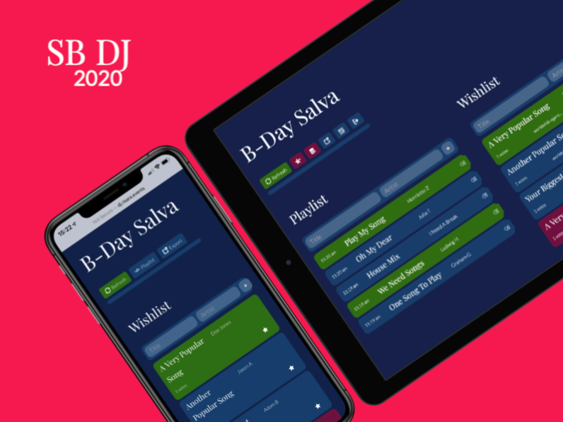

# SB-DJ

[](https://scrutinizer-ci.com/g/sballinone/SB-DJ/?branch=master)
[](https://scrutinizer-ci.com/g/sballinone/SB-DJ/build-status/master)
[](https://github.com/sballinone/SB-DJ/releases/)

DJ Compagnon app



**SETLIST** Create your setlist and enjoy full playlist integration. Ask your guests before your event and add wishes to the setlist.

**WISHLIST** Are you tired of guests interupting you with their wishes? As your Co-DJ, SB DJ allowes your guests sending their wishes without interupting you.

**PLAYLIST** Create your playlist and CSV-export it at the end of the night. If you prefer to provide your playlist at the end of the night, just import it.

**QR CODE FLYER** Allow your guests to access the public part of SB DJ quickly by printing flyers with a QR Code.

**WE SPEAK YOUR LANGUAGE** Provide your guests a localized experience. English, Spanisch and German built in. You can add as many languages as you want.

**BUILT IN SECURITY** Secure your actor's part of the software from the public part. Disallow "double-votes" on wishes. High code quality.

* * *

## 2020.2 OUTVIEW

Let's create your personal DJ profile. Import your djay session list and share it within the DJ community. Manage your setlists.

* * *

## Changelog

See [CHANGELOG.md](CHANGELOG.md)

* * *

## Requirements

-   This software needs a Webserver with PHP, MySQL

## Installation

We recommend using git to install SB DJ. This makes it very easy to update SB DJ.

1.  Go to the directory, where you plan to run SB DJ in.
2.  Initialize and clone the repository: 

    ```
    git init
    git clone https://github.com/sballinone/SB-DJ.git
    ```

_Note: git clone creates a subdirectory called "SB-DJ". You may clone your repository to the parent level and symlink your htdocs to SB-DJ._

3.  Create a database and inport database.sql
    
    ```
    mysql -u <username> -p <database> < database.sql
    ```

4.  Run SB-DJ in your webbrowser. It should redirect you to setup.php.

### Update

1.  To update SB DJ, just go into your git repository and pull the new updates.

    ```
    git pull
    ```

2.  Open SB DJ and go into the configuration (setup.php). Save the configuration to update your local config.php. This fits your config.php to the installed release.

_Please note: There is always the latest release of SB DJ hosted within the repository. We host beta releases on the beta branch._

### Quick Start

-   Run SB DJ by opening the application in your webbrowser. 
-   If you have enabled shortcuts, you find the buttons "FE" (Frontend) and "BE" (Backend) on the bottom. Press "BE" to enter the DJ interface of the software (Default setting).
-   If you have disabled shortcuts and cannot see the BE button, open backend.php to view the backend.

## Timezone

If you import your CSV file from djay, you may encounter the timezone issue: the timetable of the playlist is shifted by a few hours. In this case, check your timezone settings in your server environment. 
As a workaround, you may run a SQL query to update **all** playlist entries. For example, if you live in Central Europe (+2), but your server shows the hours in Greenwich (+0), you may use the following query to shift all hours two hours forward:

    UPDATE playlist SET timestamp = DATE_ADD(timestamp, INTERVAL 2 HOUR)

## Translation

-   You may add as many languages as you want: Just copy the file ./lang/en.php, paste the new file named with the two letter language code (e.G. fr.php for French) and translate everything after the = operators. Remember not to change vars.

    Example: 

    English: 

        $output["welcome"] = "Welcome ".$\_SESSION["firstname"]; 

    German: 

        $output["welcome"] = "Willkommen ".$\_SESSION["firstname"];

* * *

## Thank you

For this software we used some open source projects:

-   IcoFont - <https://icofont.com>
-   Google Webfonts - <https://fonts.google.com>
-   Google Webfont Helper - <https://google-webfonts-helper.herokuapp.com/fonts>
-   goQR.com QR Code Generator - <https://goqr.me/api/>

Thank you to the open source community.
